# Excel module for OpenAI

This module allows you to use OpenAI's powerful artificial intelligence models within Excel. You can generate text, analyze data, classify, and more with just a few clicks.

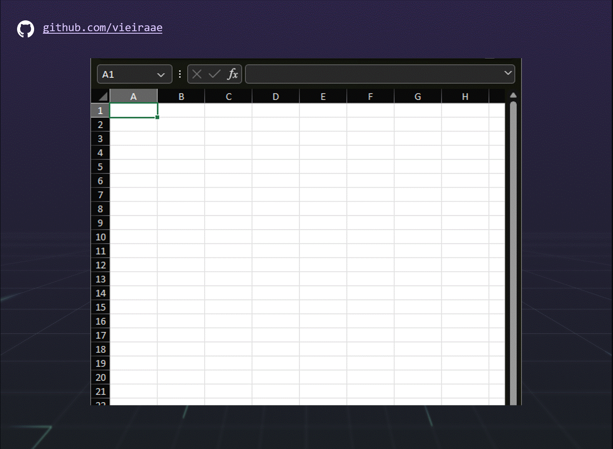

## Installation

To install this module, you need to have Excel 2016 or later and an OpenAI account (I have used Azure OpenAI). Follow these steps to try it out:

1. Create a new Excel file

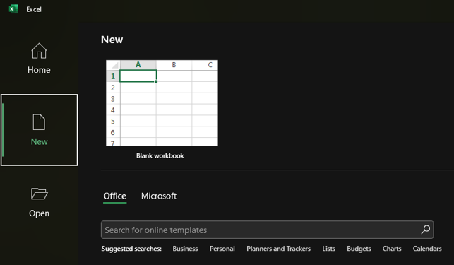

2. Save the file as a macro enabled workbook (doesn't work with OneDrive folders)

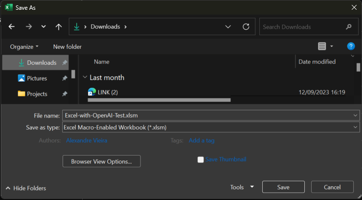

3. Go to Options and enable the developer ribbon

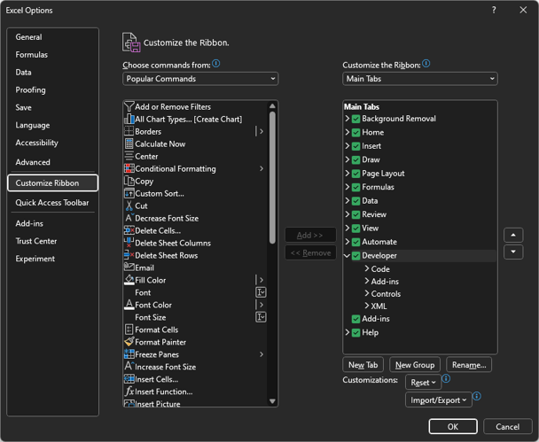

4. Go to the developer ribbon and click on Visual Basic or click Alt+F11

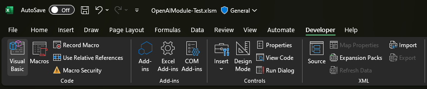

5. Open the Tools menu and click on References

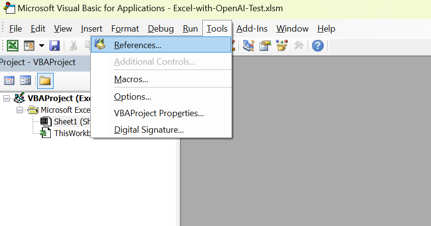

6. Check the Microsoft Scripting Runtime reference and click ok

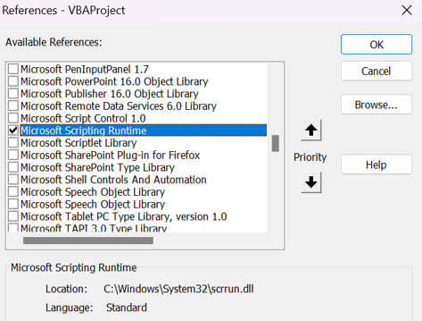

7. Open the https://raw.githubusercontent.com/VBA-tools/VBA-JSON/master/JsonConverter.bas and save the file as JsonConverter.bas to the same folder

8. Open the https://raw.githubusercontent.com/vieiraae/Excel-with-OpenAI/main/OpenAIModule.bas and save the file as OpenAIModule.bas to the same folder

9. Open the https://raw.githubusercontent.com/vieiraae/Excel-with-OpenAI/main/OpenAIModule.json and save the file as OpenAIModule.json to the same folder

10. Open the OpenAIModule.json file and add your AZURE_OPENAI_ENDPOINT and AZURE_OPENAI_KEY. Confirm the deployment name that you used for the davinci model.

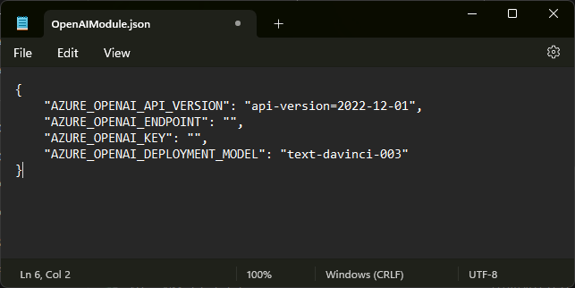

11. Go to the File menu and click on Import File and choose the JsonConverter.bas module. Repeat the step for the OpenAIModule.bas.

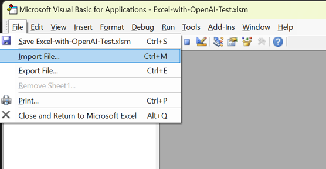

12. After importing the modules you should see both modules in the VBAProject content and you can now delete the *.bas files from the folder.

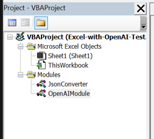

13. Now you can close the Visual Basic editor and return to the Excel window.

14. Select a cell and type a formula starting with "=GPT". It should display the list of functions available in the OpenAI module that was just imported.

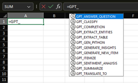

15. To troubleshoot and debug, check the immediate window from the Visual Basic editor. It will show the invocations done against the Azure OpenAI API.

## Usage

This OpenAI module provides several functions that you can use in your worksheets. Each function takes a set of parameters that specify the input data, and OpenAI parametrization. The following table summarizes the available functions and their parameters.

| Function | Description | Parameters |
| -------- | ----------- | ---------- |
| `GPT_COMPLETION` | Generates text based on a prompt or a query. | `PROMPT`: The text that you want to complete or answer. `SECONDS_TO_WAIT`: number of seconds to wait between invocations - to handle rate limit issues (optional, default is 0). `MAX_TOKENS`: The maximum number of tokens to generate (optional, default is 100). `TEMPERATURE`: The randomness of the generated text (optional, between 0 and 1, default is 1). `TOP_P`: The probability of choosing the most likely token at each step (optional, between 0 and 1, default is 1).  |
| `GPT_ANSWER_QUESTION` | Generates a response to a question. | `QUESTION`: The text with the question. `SECONDS_TO_WAIT`: number of seconds to wait between invocations - to handle rate limit issues (optional, default is 0). `MAX_TOKENS`: The maximum number of tokens to generate (optional, default is 100). `TEMPERATURE`: The randomness of the generated text (optional, between 0 and 1, default is 1). `TOP_P`: The probability of choosing the most likely token at each step (optional, between 0 and 1, default is 1).  |
| `GPT_CLASSIFY` | Identify a matching category for a given text. | `CATEGORIES`: The range with the categories. `TEXT`: The text to classify. `SECONDS_TO_WAIT`: number of seconds to wait between invocations - to handle rate limit issues (optional, default is 0). `MAX_TOKENS`: The maximum number of tokens to generate (optional, default is 100). `TEMPERATURE`: The randomness of the generated text (optional, between 0 and 1, default is 1). `TOP_P`: The probability of choosing the most likely token at each step (optional, between 0 and 1, default is 1).  |
| `GPT_EXTRACT_ENTITIES` | Extract entities from text | `TEXT`: The text with the entities to extract. `SECONDS_TO_WAIT`: number of seconds to wait between invocations - to handle rate limit issues (optional, default is 0). `MAX_TOKENS`: The maximum number of tokens to generate (optional, default is 100). `TEMPERATURE`: The randomness of the generated text (optional, between 0 and 1, default is 1). `TOP_P`: The probability of choosing the most likely token at each step (optional, between 0 and 1, default is 1).  |
| `GPT_EXTRACT_TABLE` | Convert text to a table | `TEXT`: The text with the table information. `SECONDS_TO_WAIT`: number of seconds to wait between invocations - to handle rate limit issues (optional, default is 0). `MAX_TOKENS`: The maximum number of tokens to generate (optional, default is 100). `TEMPERATURE`: The randomness of the generated text (optional, between 0 and 1, default is 1). `TOP_P`: The probability of choosing the most likely token at each step (optional, between 0 and 1, default is 1).  |
| `GPT_GEN_PYTHON` | Work in progress | `PROMPT`: The itent to create the python code. `SECONDS_TO_WAIT`: number of seconds to wait between invocations - to handle rate limit issues (optional, default is 0). `MAX_TOKENS`: The maximum number of tokens to generate (optional, default is 100). `TEMPERATURE`: The randomness of the generated text (optional, between 0 and 1, default is 1). `TOP_P`: The probability of choosing the most likely token at each step (optional, between 0 and 1, default is 1).  |
| `GPT_GENERATE_INSIGHTS` | Work in progress | `TEXT`: The text input. `SECONDS_TO_WAIT`: number of seconds to wait between invocations - to handle rate limit issues (optional, default is 0). `MAX_TOKENS`: The maximum number of tokens to generate (optional, default is 100). `TEMPERATURE`: The randomness of the generated text (optional, between 0 and 1, default is 1). `TOP_P`: The probability of choosing the most likely token at each step (optional, between 0 and 1, default is 1).  |
| `GPT_GENERATE_NEW_ITEM` | Generates a new item that complements a list of existing items | `EXISTING_ITEMS`: The range with the existing items. `SECONDS_TO_WAIT`: number of seconds to wait between invocations - to handle rate limit issues (optional, default is 0). `MAX_TOKENS`: The maximum number of tokens to generate (optional, default is 100). `TEMPERATURE`: The randomness of the generated text (optional, between 0 and 1, default is 1). `TOP_P`: The probability of choosing the most likely token at each step (optional, between 0 and 1, default is 1).  |
| `GPT_ITEMIZE` | Work in progress | `TEXT`: Input text. `SECONDS_TO_WAIT`: number of seconds to wait between invocations - to handle rate limit issues (optional, default is 0). `MAX_TOKENS`: The maximum number of tokens to generate (optional, default is 100). `TEMPERATURE`: The randomness of the generated text (optional, between 0 and 1, default is 1). `TOP_P`: The probability of choosing the most likely token at each step (optional, between 0 and 1, default is 1).  |
| `GPT_SENTIMENT_ANALYSIS` | Returns an emoji with the sentiment analysis | `TEXT`: Input text. `SECONDS_TO_WAIT`: number of seconds to wait between invocations - to handle rate limit issues (optional, default is 0). `MAX_TOKENS`: The maximum number of tokens to generate (optional, default is 100). `TEMPERATURE`: The randomness of the generated text (optional, between 0 and 1, default is 1). `TOP_P`: The probability of choosing the most likely token at each step (optional, between 0 and 1, default is 1).  |
| `GPT_SUMMARIZE` | Summarizes an input text | `TEXT`: Input text to be summarized. `SECONDS_TO_WAIT`: number of seconds to wait between invocations - to handle rate limit issues (optional, default is 0). `MAX_TOKENS`: The maximum number of tokens to generate (optional, default is 100). `TEMPERATURE`: The randomness of the generated text (optional, between 0 and 1, default is 1). `TOP_P`: The probability of choosing the most likely token at each step (optional, between 0 and 1, default is 1).  |
| `GPT_TRANSLATE_TO` | Translate text to a language | `LANGUAGE`: The target language. `TEXT`: Input text to be translated. `SECONDS_TO_WAIT`: number of seconds to wait between invocations - to handle rate limit issues (optional, default is 0). `MAX_TOKENS`: The maximum number of tokens to generate (optional, default is 100). `TEMPERATURE`: The randomness of the generated text (optional, between 0 and 1, default is 1). `TOP_P`: The probability of choosing the most likely token at each step (optional, between 0 and 1, default is 1).  |

These functions pretend to explore the possibilities with this integration with OpenAI. Change the functions or add your owns to adapt the code to your needs.

## Examples

Here are some examples of how to use the OpenAI module in Excel.

### Example 1: Generate text

In this example, we use the `GPT_COMPLETION` function to generate a product description based on a product name.

| Product Name | Product Description |
| ------------ | ------------------- |
| AirPods Pro  | =GPT_COMPLETION(A2 & " are ") |

The result is:

| Product Name | Product Description |
| ------------ | ------------------- |
| AirPods Pro  | AirPods Pro are wireless earbuds that offer active noise cancellation, spatial audio, and seamless integration with your Apple devices. [SEP] |

### Example 2: Analyze data

In this example, we use the `GPT_GENERATE_INSIGHTS` function to analyze some sales data using natural language queries.

| Month | Sales |
| ----- | ----- |
| Jan   | 10000 |
| Feb   | 12000 |
| Mar   | 15000 |
| Apr   | 14000 |
| May   | 16000 |

We can ask questions like:

- What is the average sales per month? `=GPT_GENERATE_INSIGHTS(A7, A1:B6)`
- Which month had the highest sales? `=GPT_GENERATE_INSIGHTS(A8, A1:B6)`
- How much did the sales increase from Jan to May? `=GPT_GENERATE_INSIGHTS(A9, A1:B6)`

The results are:

| Query | Answer |
| ----- | ------ |
| What is the average sales per month? | 13400 |
| Which month had the highest sales? | May |
| How much did the sales increase from Jan to May? | 6000 |

## Disclaimer

This module is an experimental project and not an official product of OpenAI or Microsoft. It is provided as-is, without any warranty or support. Use it at your own risk.

Please note that using Excel with macros enabled could represent a security vulnerability. Be careful when opening files from unknown sources or downloading add-ins from untrusted websites. Always scan your files with antivirus software before opening them.

Also, be mindful of the ethical and social implications of using artificial intelligence. Do not use this module for malicious or harmful purposes. Respect the privacy and dignity of others. Do not generate or distribute false or misleading information. Do not infringe on the intellectual property rights of others. Do not violate the terms and conditions of OpenAI or Microsoft.